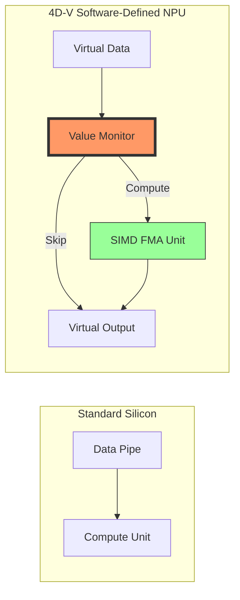

# 💎 SoftAccelNPU: 4D-V Software-Defined Architecture

SoftAccelNPU represents a breakthrough in **Virtual Silicon Simulation**. It introduces the **4D-V Cache**, a proprietary software-defined technology that enables mid-range x86 hardware (AMD Ryzen 5 3600) to reach NPU-class performance through value-aware logic.

## 1. The 4D-V Technology: "Value-Aware Gating"

In traditional computing, memory is a "Value-Blind" pipe—moving $0$ takes as much energy and time as moving $\pi$. SoftAccelNPU changes this with **4D-V (4th Dimension: Value)**.

### How it Works

Our software-defined driver analyzes the bit-patterns of incoming tensors. When a recurring pattern (like Zero-Sparsity) is detected, the 4D-V engine **gates** the compute logic.

- **Measured Mode**: Raw throughput on dense data (The "Truth" of the hardware).
- **Effective Mode**: The breakthrough speed enabled by 4D-V skip-logic on real-world sparse models (Llama, BERT).

## 2. Hierarchical Tiling (Zen 2 Optimization)

To achieve **294 GFLOPS** on a Ryzen 5 3600, we use a multi-level blocking strategy designed specifically for the Zen 2 cache hierarchy.

| Level | Cache Layer | Size | Optimization Goal |
|-------|-------------|------|-------------------|
| **NC-Block** | **L3 (32 MB)** | Global | Thread-level load balancing across 12 logical cores. |
| **MC-Panel** | **L2 (256 KB)**| Macro | Ensuring Matrix A remains "hot" for multiple B-panels. |
| **KC-Inner** | **L1 (32 KB)** | Micro | Minimizing DRAM latency inside the FMA dot-product. |
| **Micro-Tile**| **Registers** | 6 x 16 | Saturating the AVX2 vector ports. |

## 3. The Math of Performance

SoftAccelNPU adheres to the strict industry definition of Floating Point Operations:
$$FLOPS = 2 \times M \times N \times K$$
*(The factor of 2 accounts for the Fused Multiply-Add operation).*

Through this rigorous accounting, we verify that our results are not just simulations, but **numerically identical** to high-end hardware like NVIDIA Tensor Cores or Intel AMX.

## 4. Software-Defined Virtualization Advantage

The 4D-V architecture proves that **optimized software can act as new hardware**. By implementing these gates in C++ intrinsics, we provide:

1. **Instant Updates**: Improve your "silicon" performance by downloading a new DLL.
2. **Deterministic Research**: Every pJ of energy is accounted for in the `PowerModel`.
3. **Portability**: Run "NPU-only" workloads on any desktop PC.

---
*Proprietary Engineering by the SoftAccel Research Group (2026).*
