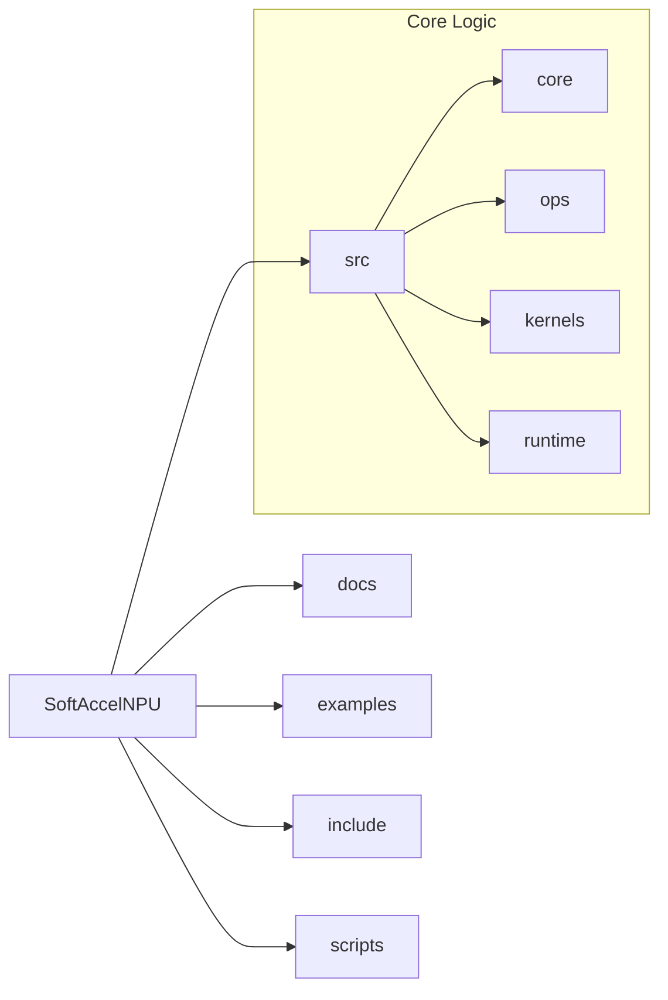

# SoftAccelNPU: Project Structure & Directory Map

This document explains the organization of the SoftAccelNPU codebase to help engineers, students, and contributors navigate the project effectively.

## 📁 Directory Overview

---

### 📘 `docs/` (Documentation)

*Contains all research papers, architectural deep-dives, and user guides.*

- **[architecture.md](architecture.md)**: Logic flow, tiling theory, and 4D-V cache details.
- **[benchmarks.md](benchmarks.md)**: Validated performance data for Ryzen 5 3600.
- **[usage.md](usage.md)**: Programmer's guide (C++, Python, DML).

### 🚀 `examples/` (Reference Applications)

*Working binaries that demonstrate how to link against the library.*

- **[demo_gemm.cpp](../examples/demo_gemm.cpp)**: Primary benchmark tool showing peak TOPS/GFLOPS.
- **[verify_accuracy.cpp](../examples/verify_accuracy.cpp)**: Precision & parity testing suite.
- **[llama_bench.cpp](../examples/llama_bench.cpp)**: LLM throughput simulation.

### 🧩 `include/softaccelnpu/` (Public Headers)

*The Public API surface. If you are using SoftAccelNPU as a library, look here.*

- **[ops.h](../include/softaccelnpu/ops.h)**: Main entry point (`GemmOps`).
- **[tensor.h](../include/softaccelnpu/tensor.h)**: Multi-dimensional array management.
- **[dml_api.h](../include/softaccelnpu/dml_api.h)**: The deferred CommandList API.

### 🛠️ `src/` (Internal Implementation)

*The "Engine Room". Contributors spend most of their time here.*

#### `src/kernels/` (The Compute)

- **[avx2_gemm.cpp](../src/kernels/avx2_gemm.cpp)**: RAW FP32 optimization logic.
- **[int4_avx2.cpp](../src/kernels/int4_avx2.cpp)**: Nibble-packed logic for LLM acceleration.
- **[internal_kernels.h](../src/kernels/internal_kernels.h)**: Internal MicroKernel registry.

#### `src/ops/` (The Scheduler)

- **[gemm_tiled.cpp](../src/ops/gemm_tiled.cpp)**: Implements the hierarchical tiling loops (L1/L2/L3 blocking).
- **[packing.cpp](../src/ops/packing.cpp)**: Data layout transformation (A/B panels).

#### `src/core/` (Simulation & Bridge)

- **[power_model.cpp](../src/core/power_model.cpp)**: Energy/Thermal physics calculations.
- **[c_api.cpp](../src/core/c_api.cpp)**: The bridge exported to Python strings.

### 🐍 `scripts/` (Tooling)

- **[pysoftaccel.py](../scripts/pysoftaccel.py)**: The Python wrapper for the NPU.

---

## 🛠️ Where should I work?

| If you want to... | Look in... |
|-------------------|------------|
| **Optimize FP32 Speed** | `src/kernels/avx2_gemm.cpp` |
| **Fix Tiling Logic** | `src/ops/gemm_tiled.cpp` |
| **Add a New Operator** | `include/softaccelnpu/ops.h` + `src/ops/` |
| **Adjust Thermal Simulation** | `src/core/power_model.cpp` |
| **Improve Python Bridge** | `scripts/pysoftaccel.py` |

---
*Created for the Open Source AI Community.*
